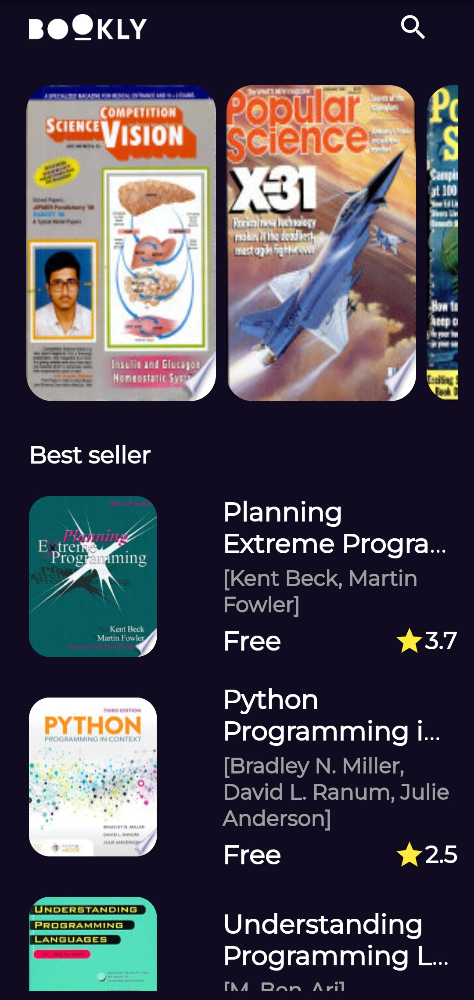
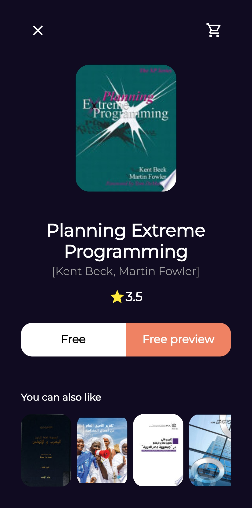
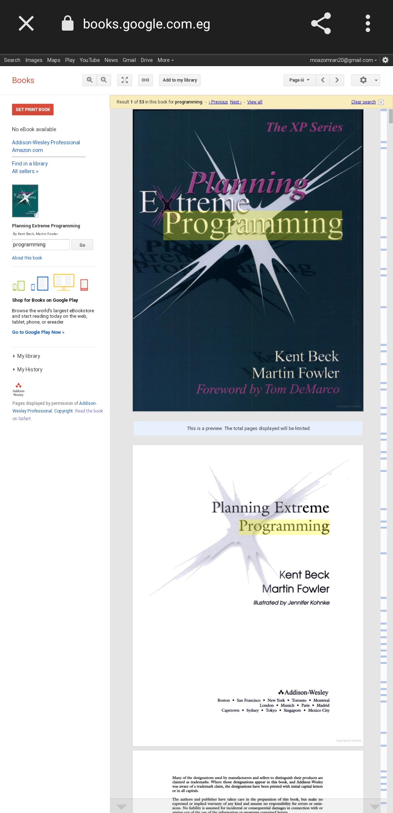
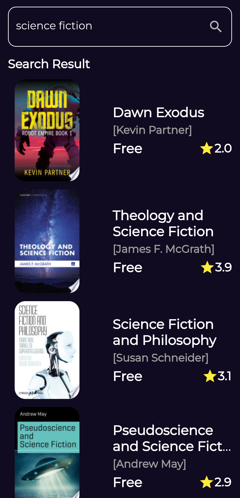

# Bookly

Discover free books on-the-go! Our Books Preview app gives you quick glimpses and excerpts to explore a world of captivating stories without spending a dime. Your next great read is just a tap away!

## Technology used:

- Navigation: go_router
- State management: Cubit
- Api Google books

## packages used:

- Dio
- flutter bloc
- dartz
- cached_network_image
- get_it

## ScreenShots

